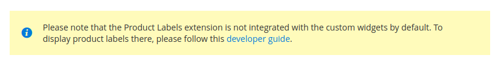

Module Extended Admin UI provides components for building common interfaces across Plumrocket Extensions.


# System Config

## Customisable Field

Provides the ability to customize basic properties of the field. For example: Css class, inherit checkbox, scope label, element attributes.

system.xml

```xml
<field>
    <frontend_model>Plumrocket\ExtendedAdminUi\Block\Adminhtml\System\Config\Form\CustomisableField</frontend_model>
    <attribute type="pr_disable_inherit_checkbox">1</attribute>
    <attribute type="pr_disable_scope_label">1</attribute>
    <attribute type="pr_element_attribute/readonly">readonly</attribute>
</field>
```

## Color Picker

For using Color Picker you should
 
1. Add frontend_model as in example below
2. Add one of pickr css themes to system config layout

Css theme 1 `Plumrocket_ExtendedAdminUi::css/lib/pickr/monolith.min.css`
Css theme 2 `Plumrocket_ExtendedAdminUi::css/form/element/color-picker.css`

system.xml

```xml
<field id="background_color" translate="label" type="text" sortOrder="30" showInDefault="1" showInWebsite="1" showInStore="1">
    <label>Background Color</label>
    <frontend_model>Plumrocket\ExtendedAdminUi\Block\Adminhtml\System\Config\Form\ColorPicker</frontend_model>
</field>
```

pr_system_config_edit_{section}.xml
```xml
    <head>
        <css src="Plumrocket_ExtendedAdminUi::css/lib/pickr/monolith.min.css"/>
    </head>
```

### Settings

Use can use attributes to change color picker configs, for example

```xml
    <attribute type="pr_pickr/components/interaction/clear">0</attribute>
```

## Radio With Images

For using Radio With Images you should

1. Change "select" or "radios" type as in example below
2. Add css to system config layout
3. Create a source model implementing \Plumrocket\ExtendedAdminUi\Api\ImageRadioButtonSourceInterface

```xml
<field id="template" translate="label" type="Plumrocket\ExtendedAdminUi\Block\Adminhtml\System\Config\Form\Element\ImageRadioButtons" sortOrder="30" showInDefault="1" showInWebsite="1" showInStore="1">
    <label>Template</label>
    <source_model>Plumrocket\ModuleName\Model\OptionSource\Template</source_model>
    <frontend_model>Plumrocket\ExtendedAdminUi\Block\Adminhtml\System\Config\Form\CustomisableField</frontend_model>
</field>
```

pr_system_config_edit_{section}.xml
```xml
    <head>
        <css src="Plumrocket_ExtendedAdminUi::css/image-radio-buttons.css"/>
    </head>
```

## Text editor (wysiwyg)

frontend_model `Plumrocket\ExtendedAdminUi\Block\Adminhtml\System\Config\Form\Editor`

Exist possibility modify wysiwyg config by adding attributes

```xml
<field id="notice_text" translate="label" type="editor" sortOrder="60" showInDefault="1" showInWebsite="1" showInStore="1">
    <label>Notice Text</label>
    <frontend_model>Plumrocket\ExtendedAdminUi\Block\Adminhtml\System\Config\Form\Editor</frontend_model>
    <config_path>prgdpr/cookie_consent/notice_text</config_path>
    <attribute type="pr_editor_height">300px</attribute>
</field>
```

## Pure Fieldset

frontend_model `Plumrocket\ExtendedAdminUi\Block\Adminhtml\System\Config\Form\PureFieldset`

Exist possibility to display fields in module configurations without a group header

```xml
<group id="pure_fieldset" translate="label" type="text" showInDefault="1" showInWebsite="1" showInStore="1">
    <frontend_model>Plumrocket\ExtendedAdminUi\Block\Adminhtml\System\Config\Form\PureFieldset</frontend_model>
    <field></field>
</group>
```

## Notice

_since 1.1.0_

Notice is an element designed to give customers tips related to the module configurations or field set but not for a single configuration field.
Styles were completely copied from magento messages to make them build-in like.

There are two variants of notices:
1. Full width

2. With label


Also, there are five levels of notice: **note, info, warning, success, error**

Example for full width info notice:
```xml
<!-- File: system.xml -->
<field id="" translate="label" type="label">
    <frontend_model>Plumrocket\ExtendedAdminUi\Block\Adminhtml\System\Config\Form\Notice</frontend_model>
    <attribute type="pr_notice__level">info</attribute>
    <attribute type="pr_notice__text">
        <![CDATA[Please follow this <a href="https://plumrocket.com/docs" target="_blank">developer guide</a>.]]>
    </attribute>
</field>
```
To add styles use update handle
```xml
<!-- File: pr_system_config_edit_{extension_section}.xml -->
<update handle="pr_system_config_element_notice"/>
```

## Option source models

### Yes (Recommended)/No

_since 1.1.0_

`Plumrocket\ExtendedAdminUi\Model\OptionSource\YesRecommended`

### Enabled (Recommended)/Disabled

_since 1.1.0_

`Plumrocket\ExtendedAdminUi\Model\OptionSource\EnabledRecommended`


# UI Forms

## Color Picker

Added for 2.2 because from 2.3 magento has its own [color picker](https://devdocs.magento.com/guides/v2.4/ui_comp_guide/components/ui-colorpicker.html)

Component `Plumrocket_ExtendedAdminUi/js/form/element/color-picker`
Template `Plumrocket_ExtendedAdminUi/form/element/color-picker`

### Example form field
```xml
<field name="label_color" formElement="input" component="Plumrocket_ExtendedAdminUi/js/form/element/color-picker">
    <settings>
        <label translate="true">Label Color</label>
        <elementTmpl>Plumrocket_ExtendedAdminUi/form/element/color-picker</elementTmpl>
        <validation>
            <rule name="validate-color" xsi:type="boolean">true</rule>
        </validation>
    </settings>
</field>
```
